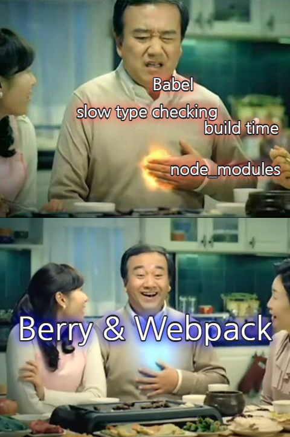

# berry-webpack



# Purpose

- 느린건 참을 수 없다.
- _우리가 어떤 민족입니까_.

# Prerequisites

- Node & Yarn(berry) ready.

# Installation

You must set your own dotenv files in root repository.

> .env.example 복붙해서 쓰십시오..

In CI, you should set proper dotenv file related with `NODE_ENV`.

e.g) `.env.development` `.env.production`

```shell
> yarn
> yarn dev
```

# Etc

## Why don't use postcss(e.g css-loader, style-loader, postcss-loader)?

It significantly drops build performance, however, I've tested with css loaders and which works fine, so feel free to adopt in your project if you want to.

## SSR?

🤔 _I have no idea 'cause I have no idea._ 🤔
_나는 아무 생각이 없다. 왜냐하면 아무 생각이 없기 때문이다._

## IE Support?

R.I.P

# License

WTFPL
